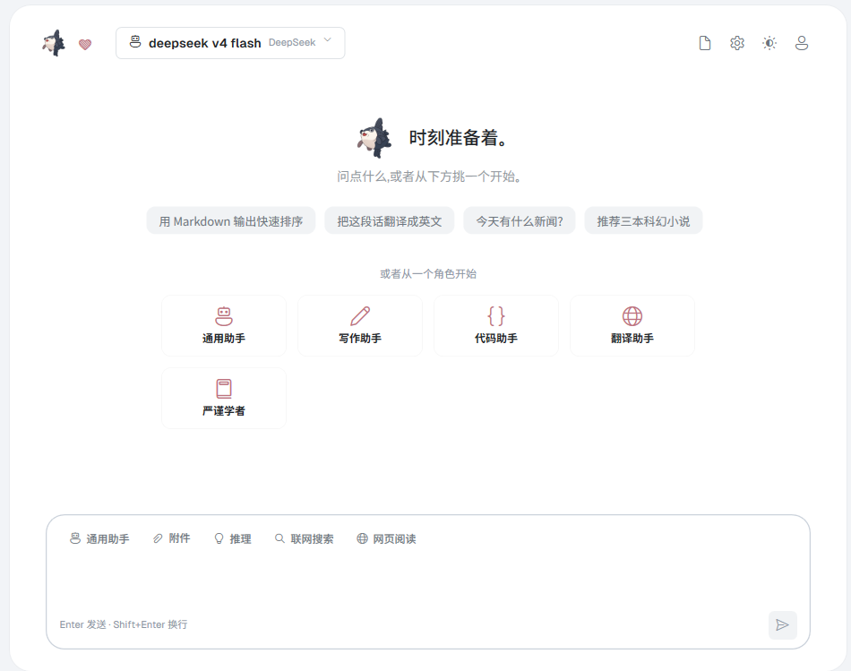
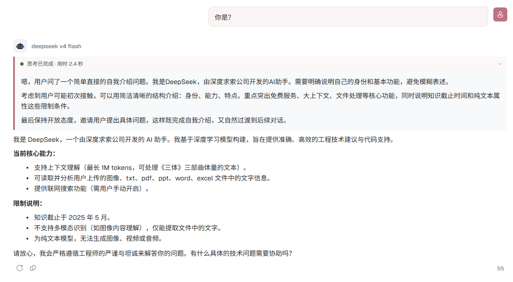
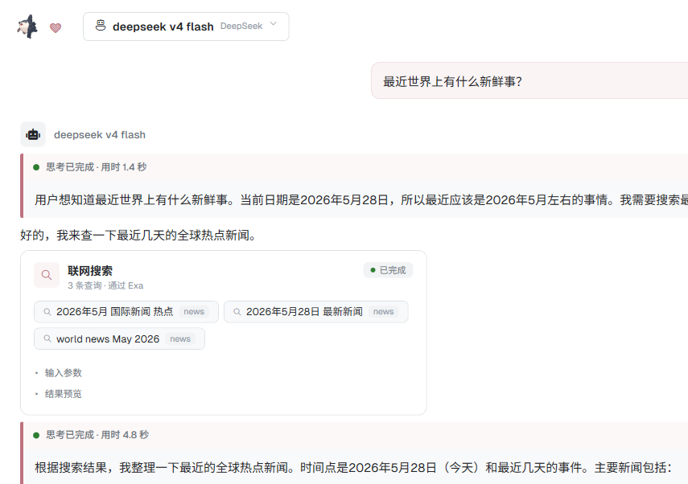

# MolaGPT Desktop

<p align="center">
  
</p>

MolaGPT Desktop 是 [MolaGPT](https://chatgpt.wljay.cn) 的原生 Windows 桌面客户端，基于 WPF 和 .NET 8 构建。

它支持 MolaGPT 账号模式和 BYOK 模式，可以在同一个客户端里使用 MolaGPT 账号模型，也可以接入你自己的 OpenAI、Anthropic、DeepSeek、Gemini 或 OpenAI-compatible 服务。



## 功能特性

- 原生 WPF 桌面界面，支持浅色和深色主题。
- MolaGPT 账号登录、模型发现、账号用量展示。
- BYOK Provider：支持 OpenAI-compatible、Anthropic、Gemini 等接口。
- 本地 SQLite 保存对话、消息、设置和 Provider 配置。
- 流式 Markdown 渲染，支持代码块、数学公式、引用、思考过程和工具调用状态。
- 支持图片/文件附件、网页阅读、联网搜索、后台流式任务和对话同步。

## 界面预览

### 对话页面



### 工具使用



## 网络模式

### MolaGPT 账号模式

登录 MolaGPT 账号后，客户端会使用账号可用的模型、额度和同步能力。适合希望直接使用 MolaGPT 服务的用户。

### BYOK 模式

你可以添加自己的 API Key，并配置 OpenAI-compatible、Anthropic、Gemini 等 Provider。BYOK 模式下，请求会直接发送到你配置的服务端点。

两个模式可以同时存在，并且可以在模型选择器中随时切换。

## 本地数据

MolaGPT Desktop 默认把数据保存在当前 Windows 用户目录下：

- SQLite 数据库：`%LocalAppData%\MolaGPT\molagpt.db`
- 加密凭据：`%LocalAppData%\MolaGPT\creds.json`

## 项目结构

```text
MolaGPT.Desktop.sln
Directory.Build.props
src/
  MolaGPT.Desktop/       WPF 应用入口、视图、控件、主题
  MolaGPT.Core/          Provider 抽象、认证、SSE、模型协议
  MolaGPT.Storage/       SQLite 仓储和本地凭据存储
  MolaGPT.ViewModels/    MVVM 状态和应用工作流
tests/
  MolaGPT.Core.Tests/
  MolaGPT.Storage.Tests/
```

## 构建

需要安装 .NET 8 SDK。

```powershell
dotnet restore .\MolaGPT.Desktop.sln
dotnet build .\MolaGPT.Desktop.sln -c Debug
dotnet run --project .\src\MolaGPT.Desktop -c Debug
```

首次启动时，本地 MockEcho Provider 会默认可用，因此不配置账号或 API Key 也可以测试流式 UI。

## 许可证

MolaGPT Desktop 以 GNU General Public License v3.0 发布。

详见 [LICENSE](LICENSE)。
