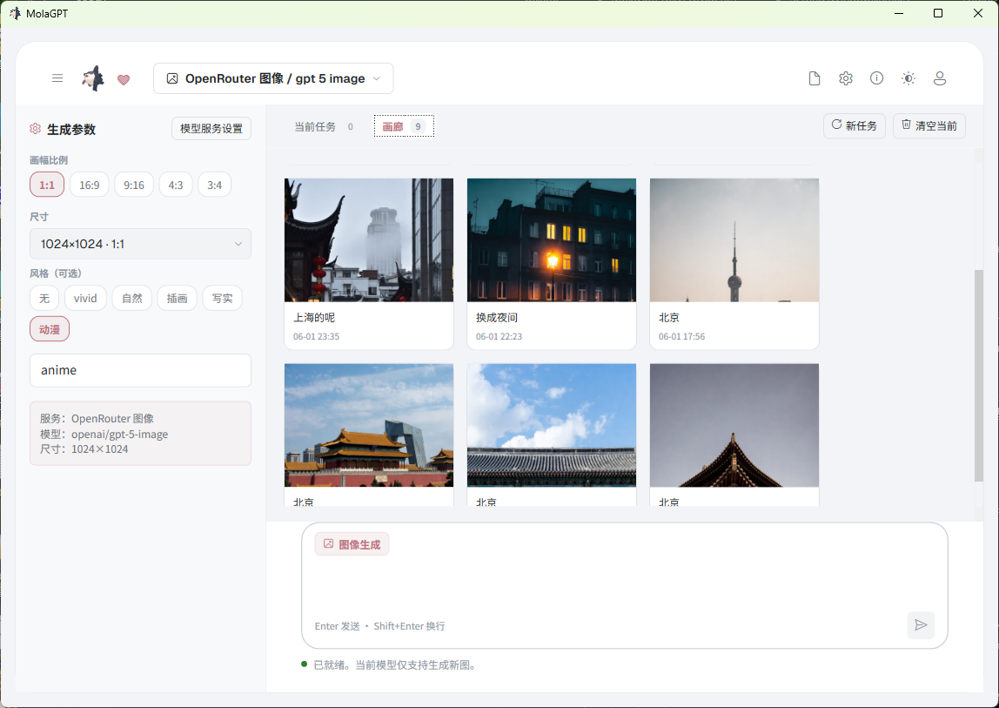

# MolaGPT Desktop

<p align="center">
  
</p>

<p align="center">
  <strong>MolaGPT 的原生 Windows 桌面客户端</strong>
</p>


<p align="center">
  <a href="https://chatgpt.wljay.cn">MolaGPT Web</a>
  ·
  <a href="https://github.com/MOLAaaaaaaa/MolaGPT.Desktop">GitHub Repository</a>
  ·
  <a href="./LICENSE">License</a>
</p>


## 简介

MolaGPT Desktop 是 [MolaGPT](https://chatgpt.wljay.cn) 的原生 Windows 桌面客户端，基于 WPF 和 .NET 10 构建。

它同时支持 MolaGPT 账号模式和 BYOK 模式。可以直接登录 MolaGPT 账号使用平台模型、账号额度和同步能力，也可以接入自己的 OpenAI、Anthropic、DeepSeek、Gemini 或 OpenAI-compatible 服务。

它可以保存本地对话，管理 Provider，处理附件，调用工具，执行联网搜索，也可以通过 Work 模式读取指定工作目录，让模型真正理解项目、文档和文件结构；同时也可以把 Claude Code / Codex 作为本地 Agent 接入桌面端工作流。

## 功能特性

### 多模型对话

MolaGPT Desktop 支持两种模型来源：

一类是 MolaGPT 账号模型。登录账号后，客户端会自动发现账号可用模型，并展示对应的账号用量和同步状态。

另一类是 BYOK Provider。可以添加自己的 API Key，并配置 OpenAI-compatible、Anthropic、Gemini 等接口。BYOK 模式下，请求会直接发送到配置的服务端点。

两种模式可以同时存在，并且可以在模型选择器中随时切换。

### 原生桌面体验

MolaGPT Desktop 使用 WPF 构建，提供更贴近 Windows 桌面应用的交互体验。

它支持浅色主题和深色主题，本地 SQLite 数据存储，后台流式任务，多会话管理，Markdown 渲染，代码块展示，数学公式，引用块，思考过程和工具调用状态显示。

### Work 模式

Work 是 MolaGPT Desktop 面向本地工作流设计的核心能力。

在 Work 模式中，可以为当前对话选择一个本地工作目录。模型可以在这个目录里读取文件、搜索文件、理解项目结构，并结合对话内容完成更贴近真实工作的任务。

它适合处理这些场景：

* 阅读一个代码仓库，分析项目结构、模块职责和潜在问题。
* 在一批文档、Markdown、代码或配置文件中查找关键词和相关上下文。
* 理解一个本地项目的 README、源码、配置、脚本和资源目录。
* 根据本地文件内容生成总结、说明文档、迁移方案或排查建议。
* 配合 Python 执行，把中间结果、图表或导出文件保存到独立输出目录。

Work 模式的文件工具默认遵循只读边界。模型可以读取文件、列出目录、glob 搜索路径、匹配文件内容。

### 工具调用

MolaGPT Desktop 支持工具调用状态展示，可以在对话中清楚看到模型正在使用的工具、输入、输出和执行进度。

当前工具能力包括：

* 网页阅读
* 联网搜索
* 文件附件读取
* 图片附件理解
* Work 目录读取
* 本地文件搜索
* Python 执行
* 图像生成
* 图像编辑

工具调用会以流式方式显示，方便追踪模型的工作过程。

### 图像生成工作台

MolaGPT Desktop 内置图像生成工作台，支持图像生成、图像编辑和自定义图像服务 Provider。

图像生成 Provider 可以单独配置聊天接口、图像生成接口、图像编辑接口和接口格式，适合接入 OpenAI Images、OpenRouter、Gemini 或其他 OpenAI-compatible 图像服务。

### 本地 Agent

MolaGPT Desktop 可以接入本机的 Claude Code 或 Codex CLI，并把它们作为独立 Agent Provider 用于对话。

本地 Agent 会保留自己的会话上下文，可以为每个对话选择工作目录，也可以在设置页查看 Agent 会话状态、桥接状态和移动端连接信息。

远程桥接默认关闭。开启后，本机 Agent 会话可以通过云端中转同步到移动端，用于远程查看和控制。

### 本地数据保存

MolaGPT Desktop 会在本地保存对话、消息、设置和 Provider 配置。默认数据位置为当前 Windows 用户目录。

* SQLite 数据库：`%LocalAppData%\MolaGPT\molagpt.db`
* 加密凭据：`%LocalAppData%\MolaGPT\creds.json`

API Key 和登录凭据会保存在本地加密凭据文件中。

## 界面预览

### 主界面


### 对话页面


### 图像生成工作台




## 网络模式

### MolaGPT 账号模式

登录 MolaGPT 账号后，客户端会使用账号可用的模型、额度和同步能力。这个模式适合希望直接使用 MolaGPT 服务的用户。

在账号模式下，模型列表、账号状态和用量信息由 MolaGPT 服务端提供。可以像使用 Web 端一样选择模型，并在桌面端继续自己的对话工作流。

### BYOK 模式

BYOK 模式适合已经拥有第三方模型服务账号，或者希望接入自部署模型、代理服务、OpenRouter、New API、LiteLLM 等 OpenAI-compatible 服务的用户。

在 BYOK 模式下，请求会直接发送到配置的服务端点。MolaGPT Desktop 只负责本地客户端、请求组装、流式响应解析和界面呈现。

### 混合使用

MolaGPT 账号模式和 BYOK 模式可以同时存在。可以在同一个客户端里登录 MolaGPT 账号，也可以添加自己的 Provider。

不同来源的模型会统一出现在模型选择器中，方便按任务切换。


### 可用能力

Work 当前主要提供这些能力：

* 读取工作目录内的文件内容。
* 列出目录结构。
* 使用 glob 搜索匹配路径。
* 在文件中搜索关键词和上下文。
* 结合附件、网页、搜索结果和对话历史进行综合分析。
* 使用 Python 处理中间数据，并把结果保存到输出目录。

### 适用场景

Work 模式适合这些任务：

* 让模型阅读一个本地代码仓库，并解释项目结构。
* 让模型根据源码生成 README、开发文档或重构建议。
* 在一堆 Markdown、PDF、代码或配置文件中查找信息。
* 批量整理本地文档，并生成结构化总结。
* 分析一个项目为什么构建失败。
* 结合本地文件和联网搜索完成调研。
* 让模型用 Python 生成表格、图表或导出文件。

## 本地数据

MolaGPT Desktop 默认把数据保存在当前 Windows 用户目录下：

```text
%LocalAppData%\MolaGPT\
```

其中主要文件包括：

```text
molagpt.db      本地 SQLite 数据库
creds.json      本地加密凭据
```

SQLite 数据库用于保存对话、消息、设置和 Provider 配置。

## 项目结构

```text
MolaGPT.Desktop.sln
Directory.Build.props

src/
  MolaGPT.Desktop/       WPF 应用入口、视图、控件、主题
  MolaGPT.Core/          Provider 抽象、认证、SSE、模型协议
  MolaGPT.Storage/       SQLite 仓储和本地凭据存储
  MolaGPT.ViewModels/    MVVM 状态和应用工作流
```

## 构建

需要安装 .NET 10 SDK。

```powershell
dotnet restore .\MolaGPT.Desktop.sln
dotnet build .\MolaGPT.Desktop.sln -c Debug
dotnet run --project .\src\MolaGPT.Desktop -c Debug
```

首次启动时，本地 MockEcho Provider 会默认可用。因此即使没有登录 MolaGPT 账号，也没有配置任何 API Key，仍然可以测试流式 UI 和基础对话界面。

## 开发状态

MolaGPT Desktop 仍在持续开发中。

当前重点包括：

* 更稳定的 Work 模式。
* 更完善的本地 Agent 和远程桥接能力。
* 更完整的本地文件工具。
* 更好的工具调用可视化。
* 更完善的图像生成工作台。
* 更自然的多 Provider 管理。
* 更细致的权限边界和用户确认机制。

欢迎提交 Issue、建议或 Pull Request。

## 许可证

MolaGPT Desktop 以 GNU General Public License v3.0 发布。

详见 [LICENSE](LICENSE)。


