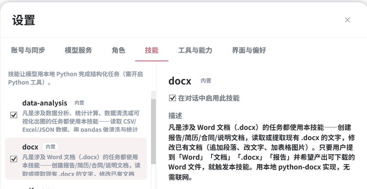

# MolaGPT Desktop

<p align="center">
  
</p>

MolaGPT Desktop 是 [MolaGPT](https://chatgpt.wljay.cn) 的原生 Windows AI 工作台，基于 WPF 和 .NET 10 构建。

它同时支持 MolaGPT 账号模式和 BYOK 模式。你可以直接使用 MolaGPT 账号里的模型和同步能力，也可以接入自己的 OpenAI、Anthropic、DeepSeek、Gemini 或 OpenAI-compatible 服务，并在同一个客户端里完成对话、联网、图像生成、本地代码沙盒和 Skills 工作流。


## 功能特性

- 原生 WPF 桌面界面，支持浅色和深色主题。
- MolaGPT 账号登录、模型发现、账号用量展示。
- BYOK Provider：支持 OpenAI-compatible、Anthropic、Gemini 等接口。
- 本地 SQLite 保存对话、消息、设置和 Provider 配置。
- 流式 Markdown 渲染，支持代码块、数学公式、引用、思考过程和工具调用状态。
- 支持图片/文件附件、网页阅读、联网搜索、后台流式任务和对话同步。
- 支持图像生成工作台、图像生成/编辑工具，以及自定义图像服务 Provider。
- 支持内置 Skills 和用户导入 Skills，BYOK 模式下可结合本地 Python 工具执行结构化任务。

## 界面预览

### 对话页面


### Skills 设置



### 工具使用


### 图像生成工作台


## 网络模式

### MolaGPT 账号模式

登录 MolaGPT 账号后，客户端会使用账号可用的模型、额度和同步能力。适合希望直接使用 MolaGPT 服务的用户。

### BYOK 模式

你可以添加自己的 API Key，并配置 OpenAI-compatible、Anthropic、Gemini 等 Provider。BYOK 模式下，请求会直接发送到你配置的服务端点。

两个模式可以同时存在，并且可以在模型选择器中随时切换。

图像生成 Provider 可以单独配置聊天接口、图像生成接口、图像编辑接口和接口格式，适合接入 OpenAI Images、OpenRouter、Gemini 或其他 OpenAI-compatible 图像服务。

## BYOK 代码沙盒

BYOK 模式下可以开启本地 Python 工具，让模型在你的电脑上完成可审计的代码任务。它适合处理表格、绘图、解析文件、整理数据和生成本地结果文件。

- 支持一键配置 MolaGPT 专用 Python 运行时。
- 默认采用审批式权限，高风险操作会先请求确认。
- 可配置网络访问、文件读取根目录和会话级允许规则。

## Skills

Skills 是一组面向任务的说明和 helper 脚本。MolaGPT Desktop 会扫描应用目录下的内置 Skills 和用户目录下的自定义 Skills，并在对话中按需提供给模型。

当前内置 Skills 包括：

- 数据分析：常见数据清洗、统计和可视化辅助脚本。
- 网页抓取：网页读取、正文提取和结构化整理辅助脚本。
- Excel：工作簿读取、写入、格式和图表相关辅助脚本。
- PDF：文本提取、页面处理和文档分析辅助脚本。
- Word：`.docx` 文档生成和编辑辅助脚本。
- PPT：演示文稿生成、版式和素材组织辅助脚本。

用户也可以从设置页导入自己的 Skills。内置 Skills 随应用分发，用户 Skills 保存在本机用户目录下。

## 本地数据

MolaGPT Desktop 默认把数据保存在当前 Windows 用户目录下：

- SQLite 数据库：`%LocalAppData%\MolaGPT\molagpt.db`
- 加密凭据：`%LocalAppData%\MolaGPT\creds.json`

## 项目结构

```text
MolaGPT.Desktop.sln
Directory.Build.props
src/
  MolaGPT.Desktop/       WPF 应用入口、视图、控件、主题
  MolaGPT.Desktop/skills/ 内置 Skills 和 helper 脚本
  MolaGPT.Core/          Provider 抽象、认证、SSE、模型协议
  MolaGPT.Storage/       SQLite 仓储和本地凭据存储
  MolaGPT.ViewModels/    MVVM 状态和应用工作流
```

## 构建

需要安装 .NET 10 SDK。

```powershell
dotnet restore .\MolaGPT.Desktop.sln
dotnet build .\MolaGPT.Desktop.sln -c Debug
dotnet run --project .\src\MolaGPT.Desktop -c Debug
```


## 许可证

MolaGPT Desktop 以 GNU General Public License v3.0 发布。

详见 [LICENSE](LICENSE)。
