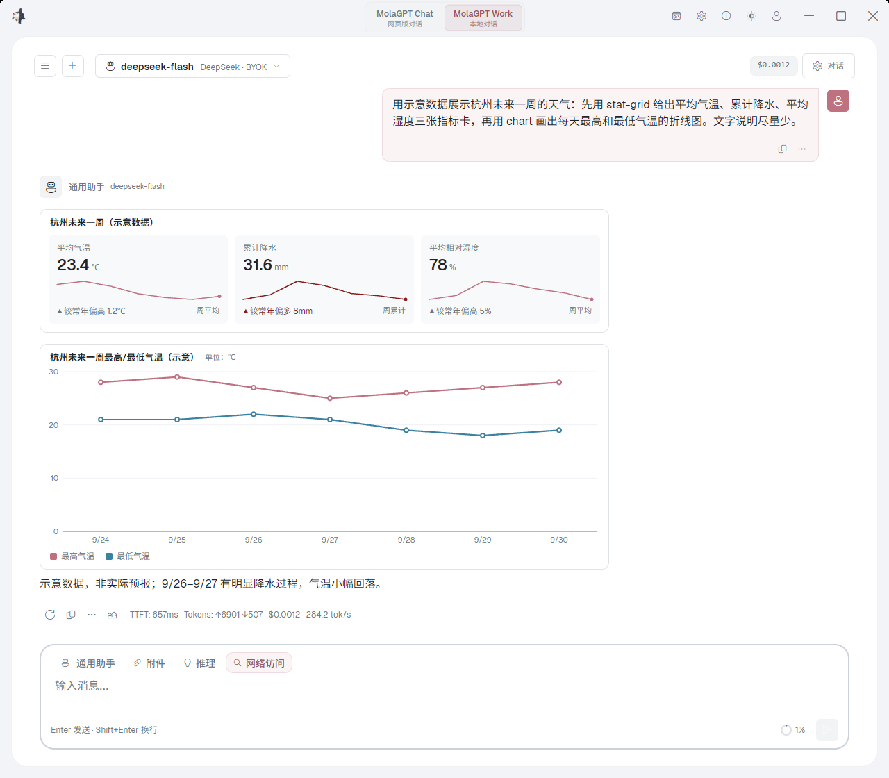
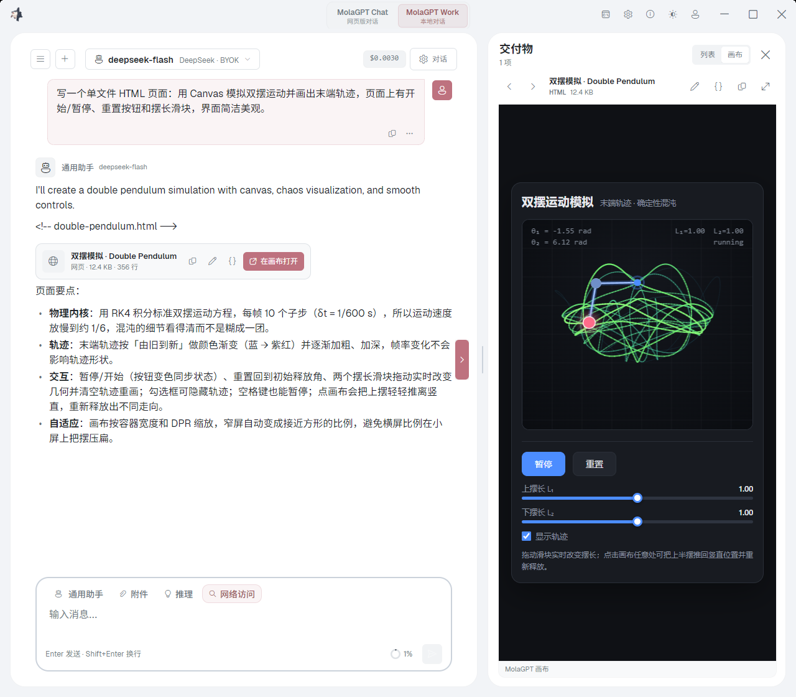
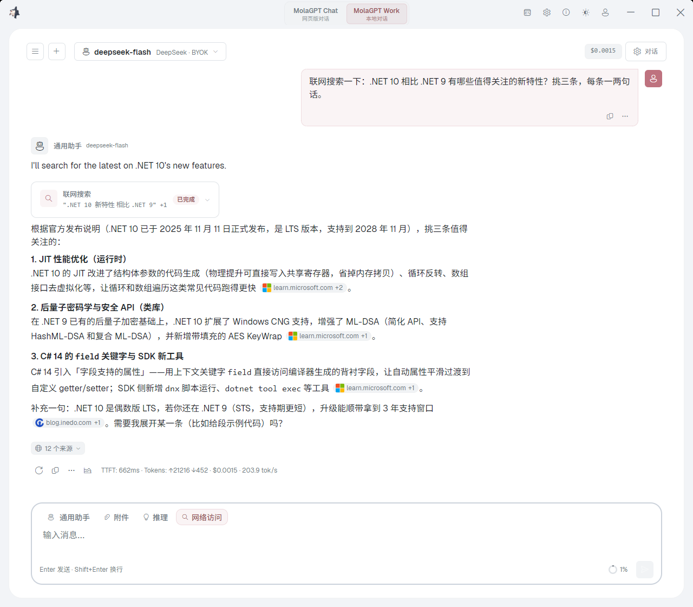
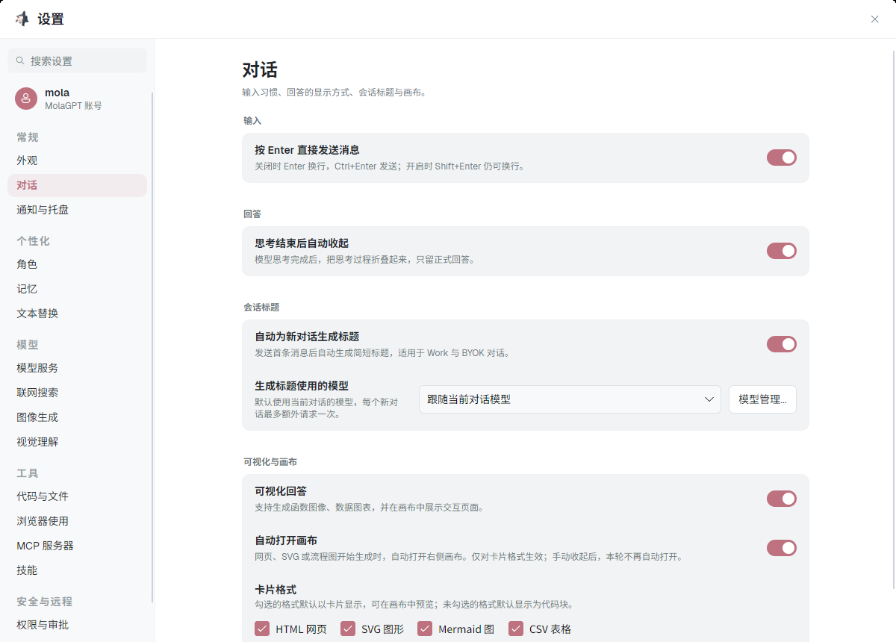

# MolaGPT Desktop

<p align="center">
  
</p>

<p align="center">
  <strong>MolaGPT 桌面客户端</strong>
</p>

<p align="center">
  <a href="https://chatgpt.wljay.cn">MolaGPT Web</a>
  ·
  <a href="https://linux.do/">LINUX DO 论坛</a>
  ·
  <a href="https://github.com/MOLAaaaaaaa/MolaGPT.Desktop/releases">下载</a>
  ·
  <a href="https://github.com/MOLAaaaaaaa/MolaGPT.Mobile">MolaGPT Mobile</a>
  ·
  <a href="./LICENSE">License</a>
</p>

## 简介

MolaGPT Desktop 是 [MolaGPT](https://chatgpt.wljay.cn) 的 Windows 桌面客户端，基于 Avalonia 和 .NET 10 构建。将日常多模型对话、本地 Agent 与文件工具、可视化回答与画布、图像生成、角色扮演和记忆放在同一个桌面应用中。

客户端分为两侧：MolaGPT Chat 是网页版对话，登录 MolaGPT 账号后使用，对话可以与网页端双向同步；MolaGPT Work 是本地对话，模型在本机的 Agent 运行环境中工作，可以调用 Python、文件、联网搜索和浏览器等本地工具。Work 一侧既可以使用 MolaGPT 账号的额度，也可以接入自己的 OpenAI、Anthropic、DeepSeek、Gemini 或 OpenAI-compatible 服务（BYOK）。


## 核心能力

### MolaGPT Chat 与 MolaGPT Work

标题栏中间的切换器对应两种对话方式：

* **MolaGPT Chat（网页版对话）**：由 MolaGPT 服务端编排，与网页端共享对话和个性化记忆，适合日常问答，以及在 Web、移动端和桌面端之间延续工作流。
* **MolaGPT Work（本地对话）**：Agent 循环在本机运行，模型可以按需调用本地工具。模型选择器中的「MolaGPT 本地对话」同时列出账号提供的 Work 模型和你自己配置的 BYOK 模型，两者只是计费来源不同。

Work 与 BYOK 由 Pi Agent 运行环境驱动，提供 Agent 循环、上下文压缩与会话续接。运行环境与应用分开发布，首次进入 Work 时按提示下载即可。

### 多模型与 BYOK

账号模型与 BYOK 服务在同一个模型选择器中切换，选择器会标出每个模型是否支持推理、工具调用和图片输入。

BYOK 服务支持 OpenAI 兼容、Anthropic、Gemini 和 OpenAI Responses 四种协议，可以独立配置接口地址、对话路径、API Key 和模型列表，适合接入官方服务、自建服务，以及 OpenRouter、New API、LiteLLM 等网关。进阶选项包括：

* 自定义请求头和请求参数覆写
* 按模型声明上下文窗口，以及视觉、工具调用、推理和图像编辑能力
* 多种推理参数格式（OpenAI Effort、Anthropic Adaptive / Budget、DeepSeek、Gemini、Qwen 等）和强度档位
* Temperature、Top-p 等生成参数，可按角色单独配置

模型价格可以一键获取，也可以手动填写。每条回答下方会显示首字延迟、Token 用量、本次费用和输出速度，模型选择器旁显示当前对话的累计花费。

### 对话与消息呈现

消息内容支持常用 Markdown 结构，包括标题、列表、引用、表格、分隔线和链接。代码块带有语法高亮，LaTeX 公式可直接在会话中渲染，图片附件、生成图片和工作目录中的图片可以打开预览。

思考过程和工具调用会显示当前状态、输入摘要、结果和错误信息，完成的思考过程可以设为自动收起。流式输出可以选择开启逐字渐显的动画效果。

对话在本地保存，支持重试、停止生成、编辑提问和回答、续写回答，重新生成后可以在不同的回答版本之间切换，也可以从任意一条消息处建立分支对话。新对话会自动生成标题；回答完成后还可以按「文本替换」中的规则（支持正则）自动处理文字。


### 可视化回答与画布

开启「可视化回答」后，模型可以直接在正文中输出可交互的小组件，与文字混排：

* **函数图像**：带参数滑块，支持缩放和拖动
* **图表**：折线、柱状、面积、散点和饼图，图例可点选，悬停读数
* **数据表**：可排序、搜索、翻页，并能导出 CSV
* **指标卡片**：带涨跌标记和历史走势小图
* **卡片网格**：条目卡片，可按标签筛选



更完整的产物会以卡片形式出现在消息中。HTML 网页、SVG 图形、Mermaid 图和 CSV 表格可以在右侧画布中打开，查看源码、编辑并直接运行；网页类产物开始生成时，画布也可以自动打开。画布运行在隔离的 WebView2 环境中，页面可以引用常用 CDN 上的前端库，在国内网络下会自动使用镜像。



### Work 与本地工具

每个 Work 对话都有自己的工作目录。根据当前模型和设置，模型可以在对话中按需：

* 运行 Python 代码，清洗数据、绘制图表，生成 Excel、Word、PDF 或 PowerPoint 文件
* 用 Read、Glob、Grep 读取、查找和搜索本地文件
* 联网搜索和阅读网页，并在回答中标注引用来源
* 调用图像生成与图像编辑服务
* 借助视觉模型理解图片，让不支持图片输入的模型也能看图
* 调用 MCP 服务器（Streamable HTTP）提供的外部工具

Python 执行可以在设置中一键配置独立的 Python 运行环境，也可以指定自己的解释器，并设置超时、输出上限、是否允许联网，以及导入与路径的放行、拦截规则。

长对话的上下文占用显示在输入框右下角，可以手动压缩，接近上限时也会自动压缩，压缩后对话可以继续进行。



### 权限与审批

写入类工具只能作用于当前对话的工作目录；只读工具在工作目录内自动放行，读取目录以外的文件时逐次询问，并可以按文件夹或磁盘记住。涉及本地执行、网络访问、图像服务或 MCP 的操作会进入审批流程，也可以按工具单独设置。

需要更少打断时可以切换到完全权限，但破坏性操作和 Python 包安装仍然需要确认。所有「始终允许」的授权都列在设置中，可以随时撤销。

### 浏览器使用

安装 [Kimi WebBridge](https://www.kimi.ai/zh-hans/products/kimi-webbridge) 浏览器扩展并启动本地服务后，MolaGPT Work 中的模型可以操作本机的 Chrome 或 Edge：打开页面、点击、填写表单、翻页收集信息，或读取登录后才能看到的内容。设置中的配置指引会带你完成连接。

浏览器操作在当前浏览器配置文件中进行，任务标签页会归入 MolaGPT 标签组，可以随时手动关闭。打开页面、点击、填写等操作按网站审批并可记住，下载、授权、支付等敏感操作每次都需要确认；网站允许与禁止名单、操作记录都可以在设置中查看。

### Agent Skills

客户端内置了一组可由本地工具执行的 Skills。模型会根据任务读取 Skill 说明和辅助脚本，用于更稳定地完成常见的文件、数据和网页工作。

内置 Skills 包括：

* 数据分析与可视化
* Word 文档读取与生成
* PDF 读取、生成和处理
* Excel 工作簿读取与生成
* PowerPoint 演示文稿处理
* 网页内容提取与 Markdown 转换
* 浏览器操作

设置中的技能页可以启用或停用内置 Skills，也可以导入包含 `SKILL.md` 的 ZIP 压缩包，或从技能目录加载自己的 Skill。Skill 需要模型能读取本地文件，开启 Python 执行或文件读取后才会生效；导入的 Skill 保存在当前 Windows 用户的数据目录中。

### 角色与氛围模式

角色分为两种模式。对话角色是常规助手，可以设置系统提示词（支持日期、模型、用户名等变量）、默认模型、工具和生成参数。氛围角色面向角色扮演：

* 导入和导出角色卡（JSON / PNG），兼容角色卡规范与 SillyTavern 格式
* 开场白与备选开场
* 角色世界书与共享世界书，按 Token 预算注入
* 用户身份，决定角色如何称呼你、把你当作谁
* 故事记忆，随对话推进自动整理剧情摘要

氛围对话与本地记忆相互隔离：既不读取记忆，也不会被整理进记忆。

### 记忆

MolaGPT Work 带有本地记忆系统。它会从对话中整理值得长期保留的信息、生成用户画像，并在需要时检索本机的历史对话。记忆以文件形式保存在本机，可以在设置中按主题查看和编辑，也可以设置整理所用的模型、记忆上限，以及是否允许写入密钥、证件号等敏感信息。输入框上的「记忆」开关可以让单个对话既不读取、也不留下记忆。

登录账号后，MolaGPT Chat 使用账号侧的个性化记忆 MolaGPT Tracks。你可以查看 MolaGPT 记住了什么，为每条记忆评分、修正或删除，并设置回复的语气偏好。

### 图像生成工作台

图像生成工作台可以单独选择图像服务，支持 OpenAI 图像接口（DALL·E、gpt-image）和对话补全出图（OpenRouter、nano-banana 等）两类接口。生成模式适合一次出图；对话模式会在最新结果上连续修改，适合逐步调整同一张图。工作台也可以载入底图进行编辑，并设置比例、风格和数量。

生成任务和历史图片保存在本地画廊中，可以预览、保存，或作为附件继续交给模型分析或编辑。支持工具调用的 BYOK 对话也可以直接调用配置好的图像服务。


### 远程控制

开启「远程控制」后，本机的 Claude Code 和 Codex 会话会经 MolaGPT 云端中转，同步到登录同一账号的 MolaGPT App，用于在手机上远程查看和控制；Agent 本体仍运行在这台电脑上。设置页会列出本机会话的同步状态和已连接的设备。该功能默认关闭。

### 设置与通知

设置按「常规、个性化、模型、工具、安全与远程」分组，账号页单独放在最上方，顶部的搜索框可以直接定位到具体设置项。



应用内的提示统一以横幅呈现，下载、同步等进度会在同一条横幅上原地更新；只有回答在后台完成时才会发送 Windows 系统通知。关闭窗口时可以选择最小化到系统托盘。

界面支持跟随系统、浅色和深色三种主题，以及 80%、100%、120%、140% 的文字大小，并适配 Windows 高 DPI 缩放。

## 使用场景

* 在 MolaGPT 账号模型和自己的 API 之间按任务切换，并随时看到每次回答的用量和费用。
* 让模型阅读本地的代码仓库或文档目录，梳理结构、查找实现位置或分析问题。
* 用 Python 清洗数据、绘制图表，生成 Excel、Word、PDF 或 PowerPoint 文件。
* 让模型直接在回答里画出函数图像、图表和数据表，或在画布中写一个可以运行的小工具页面。
* 结合图片、文件、网页和带引用来源的联网搜索完成研究、写作或资料整理。
* 让模型在自己的浏览器里完成查询、填表、跨页收集信息等操作。
* 导入角色卡，在氛围模式中进行带世界书和故事记忆的角色扮演。
* 通过图像工作台生成或编辑图片，并在后续对话中继续使用结果。
* 在手机上查看和控制本机正在运行的 Claude Code 或 Codex 会话。

## 开始使用

### 安装

从 [Releases](https://github.com/MOLAaaaaaaa/MolaGPT.Desktop/releases) 下载 Windows x64 安装包并完成安装。MolaGPT Desktop 支持 Windows 10（1809 及以上）和 Windows 11，请注意首次启动时 Windows SmartScreen 可能出现提示，这是正常的。

首次启动后，可以选择以下任一方式开始：

1. 登录 MolaGPT 账号，直接使用账号中的模型、额度和同步能力。
2. 在「设置 → 模型服务」中添加自己的对话服务，填写接口地址、API Key 和模型。
3. 切换到 MolaGPT Work 时，按提示下载 Agent 运行环境；需要运行 Python 时，在「设置 → 代码与文件」中一键配置 Python 运行环境。

画布依赖 Microsoft Edge WebView2 Runtime.

### MolaGPT 账号模式

登录账号后，客户端会自动发现可用模型，并展示额度、今日用量和各模型用量。MolaGPT Chat 对话可以与网页端双向同步，Work 与 BYOK 对话不参与同步。账号模式适合希望直接使用 MolaGPT 服务、并在 Web、移动端和桌面端之间延续工作流的用户。

### BYOK 模式

BYOK 模式适合已有第三方模型服务账号，或希望连接自建模型服务和代理网关的用户。请求会直接发送到配置的服务端点，Agent 循环在本机运行，MolaGPT Desktop 负责本地对话、流式解析、工具编排和界面呈现。

## 本地数据

MolaGPT Desktop 默认将数据保存到当前 Windows 用户目录：

```text
%LocalAppData%\MolaGPT\
```

主要文件包括：

```text
molagpt.db      本地 SQLite 数据库
creds.json      本地加密凭据
attachments\    对话附件
python-tool\    各对话的工作目录
pi-sessions\    Agent 会话记录
memory\         本地记忆
role-assets\    角色卡图片等资源
skills\         用户导入的 Agent Skills
canvas\         画布使用的 WebView2 数据
```

SQLite 数据库保存对话、消息、设置和模型服务配置。API Key 与登录凭据保存在本地加密凭据文件中。内置 Skills 随应用安装，用户导入的 Skills 保存在上述数据目录中。

Agent 运行环境和 Python 运行环境单独存放在以下目录：

```text
%LocalAppData%\MolaGPT Desktop\PiSidecar\
%LocalAppData%\MolaGPT Desktop\PythonRuntime\
```

## 项目结构

```text
MolaGPT.Desktop.sln
Directory.Build.props

src/
  MolaGPT.App/           Avalonia 应用入口、窗口、主题、消息渲染和画布
  MolaGPT.Core/          Provider 抽象、认证、SSE、Agent、工具、记忆与模型协议
  MolaGPT.Presentation/  Markdown 解析、可视化组件解析与平台无关的呈现模型
  MolaGPT.Services/      桌面应用服务与运行环境管理
  MolaGPT.Storage/       SQLite 仓储和本地凭据存储
  MolaGPT.ViewModels/    MVVM 状态和应用工作流
  skills/                随应用分发的内置 Agent Skills
```

## 构建

需要安装 .NET 10 SDK。

```powershell
dotnet restore .\MolaGPT.Desktop.sln
dotnet build .\MolaGPT.Desktop.sln -c Debug
dotnet run --project .\src\MolaGPT.App -c Debug
```

Work 与 BYOK 所需的 Agent 运行环境由应用在首次进入 Work 时下载，Python 运行环境可以在设置中一键配置，两者都不需要在本地构建。

## 许可证

MolaGPT Desktop 以 GNU General Public License v3.0 发布，详见 [LICENSE](LICENSE)。
