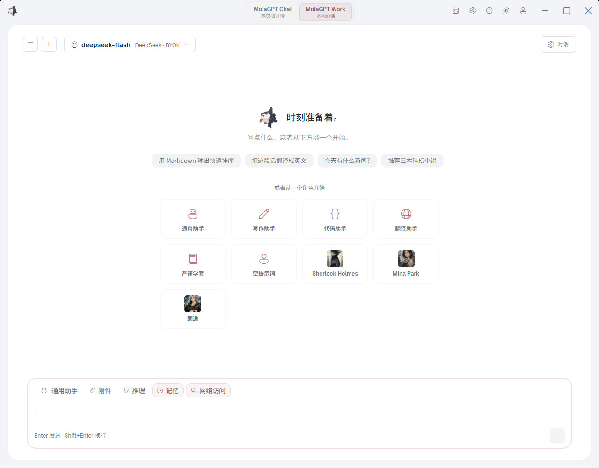
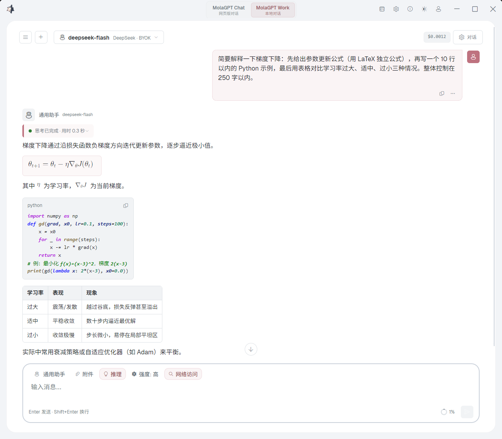
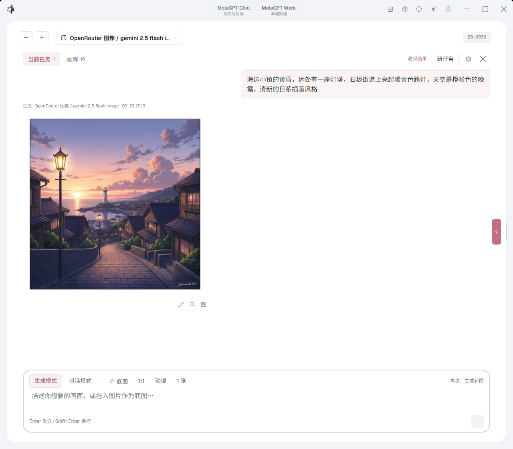

# MolaGPT Desktop

<p align="center">
  
</p>

<p align="center">
  <strong>MolaGPT 的原生 Windows 桌面客户端</strong>
</p>

<p align="center">
  <a href="https://chatgpt.wljay.cn">MolaGPT Web</a>
  ·
  <a href="https://github.com/MOLAaaaaaaa/MolaGPT.Desktop/releases">下载</a>
  ·
  <a href="https://github.com/MOLAaaaaaaa/MolaGPT.Desktop">GitHub Repository</a>
  ·
  <a href="./LICENSE">License</a>
</p>

## 简介

MolaGPT Desktop 是 [MolaGPT](https://chatgpt.wljay.cn) 的 Windows 桌面客户端，基于 Avalonia 和 .NET 10 构建。它把日常多模型对话、本地工作目录、文件与 Python 工具、图像生成和本地 Agent 放在同一个桌面应用中。

客户端同时支持 MolaGPT 账号模式和 BYOK 模式。登录 MolaGPT 账号后，可以直接使用账号可用的模型、额度和同步能力；也可以接入自己的 OpenAI、Anthropic、DeepSeek、Gemini 或 OpenAI-compatible 服务。

v1.0 重新构建了整个桌面界面和消息呈现层。长对话、Markdown、代码、公式、图片、思考过程和工具调用都由新的原生界面完成渲染，同时保留已有的 Provider、Work、图像工作台和本地 Agent 工作流。

## 核心能力

### 多模型对话

账号模型与 BYOK Provider 可以同时存在，并在同一个模型选择器中切换。BYOK Provider 支持独立配置接口地址、模型、API Key、请求格式和附加参数，适合接入官方服务、自建服务、OpenRouter、New API 或 LiteLLM 等 OpenAI-compatible 网关。

对话在本地保存，支持多会话管理、流式输出、重试、停止生成、附件和角色提示词。模型的思考过程、工具调用过程和最终回答会按内容类型呈现，长会话可以随时跳回最新消息。

### 原生桌面界面

MolaGPT Desktop 使用 Avalonia 构建新的 Windows 桌面界面，统一了主窗口、设置、账号、关于、工具审批和图像工作台等窗口的视觉与交互。

界面支持浅色和深色主题、Windows 高 DPI 缩放以及 80%、100%、120%、140% 的字体缩放。会话区域采用稳定的虚拟化布局，适合持续生成和浏览较长的对话内容。

### 丰富的消息呈现

消息内容支持常用 Markdown 结构，包括标题、列表、引用、表格、分隔线和链接。代码块带有语法高亮和独立滚动区域，LaTeX 公式可直接在会话中显示，图片附件、生成图片和工作目录中的图片可以打开预览。

思考过程和工具调用会显示当前状态、输入摘要、结果和错误信息。完成的思考过程可在设置中设为自动折叠，工具卡片在流式输出期间保持紧凑且可追踪。

### Work 模式

Work 面向本地项目、文档和数据处理场景。为对话选择工作目录后，模型可以在授权范围内读取文件、列出目录、按 glob 查找路径、搜索文件内容，并结合附件、网页、联网搜索和对话历史完成任务。

Work 适合阅读代码仓库、梳理项目结构、查找配置和文档、分析构建问题、整理资料，以及把分析结果输出到工作目录。文件工具默认遵循只读边界；需要执行 Python 或其他受控操作时，应用会显示明确的审批请求。

可选的 Pi Agent 运行时为 Work 和受支持的 BYOK Provider 提供 Agent 循环、上下文压缩与会话续接能力。未配置时，Work 仍可使用内置引擎。

### Agent Skills

客户端内置了一组可由本地 Python 工具执行的 Skills。开启对应工具的 BYOK 对话会根据任务读取 Skill 说明和辅助脚本，用于更稳定地完成常见文件与数据工作。

内置 Skills 包括：

* 数据分析与可视化
* Word 文档读取与生成
* PDF 读取、生成和处理
* Excel 工作簿读取与生成
* PowerPoint 演示文稿处理
* 网页内容提取与 Markdown 转换

设置中的技能页可以启用或停用内置 Skills，也可以从文件夹或 ZIP 压缩包导入自己的 Skill。导入的 Skill 与内置 Skill 一样以 `SKILL.md` 作为入口，并保存在当前 Windows 用户的数据目录中。

### 工具与权限

根据当前模型和设置，MolaGPT Desktop 可以使用网页阅读、联网搜索、附件读取、图片理解、本地工作目录读取、文件搜索、Python 执行、图像生成、图像编辑和 MCP 工具。

工具调用在对话中以流式状态显示。涉及本地执行、网络访问、图像服务或 MCP 的操作会进入审批流程；同一会话中可以按需记住已允许的选择，避免重复打断正常工作。

### 图像生成工作台

图像生成工作台可以单独配置聊天、图像生成和图像编辑服务。它支持自定义模型、尺寸、比例、风格、参考图和接口格式，适合接入 OpenAI Images、OpenRouter、Gemini 或其他兼容图像接口。

生成任务和历史图片会保存在本地，图片可在工作台或对话中直接预览。生成结果也可以作为附件继续交给模型分析或编辑。

### 本地 Agent 与远程桥接

MolaGPT Desktop 可以接入本机的 Claude Code 或 Codex CLI，并将它们作为独立 Agent Provider 使用。每个 Agent 会话可以选择工作目录并保留自身的会话上下文，应用会显示会话和桥接状态。

远程桥接默认关闭。开启后，本机 Agent 会话可以通过 MolaGPT 服务同步到移动端，用于远程查看和控制；Agent 本体仍运行在配置它的桌面设备上。

## 使用场景

* 在账号模型、自己的 API 和本地 Agent 之间按任务切换。
* 让模型阅读一个代码仓库，解释模块职责、查找实现位置或分析构建失败原因。
* 在 Markdown、PDF、Office 文档、代码和配置文件中检索信息并输出总结。
* 用 Python 清洗数据、绘制图表、生成 Excel、Word、PDF 或 PowerPoint 文件。
* 结合图片、文件、网页和联网搜索完成研究、写作或资料整理。
* 通过图像工作台生成图片，并在后续对话中继续分析或编辑结果。

## 界面预览

### 主界面



### 对话页面



### 图像生成工作台



## 开始使用

### 安装

从 [Releases](https://github.com/MOLAaaaaaaa/MolaGPT.Desktop/releases) 下载 Windows x64 安装包并完成安装。首次启动后，可以选择以下任一方式开始：

1. 登录 MolaGPT 账号，直接使用账号中的模型、额度和同步能力。
2. 在设置中添加自己的 Provider，填写 API Key、接口地址和模型。
3. 新建对话，或在 Work 中选择本地工作目录后开始处理文件与项目。

首次启动时，本地 MockEcho Provider 会默认可用。因此即使没有登录账号、也没有配置 API Key，仍可体验流式界面和基础对话流程。

### MolaGPT 账号模式

登录账号后，客户端会自动发现可用模型，并展示账号状态、用量和同步信息。账号模式适合希望直接使用 MolaGPT 服务、并在 Web、移动端和桌面端之间延续工作流的用户。

### BYOK 模式

BYOK 模式适合已有第三方模型服务账号，或希望连接自建模型服务和代理网关的用户。请求会直接发送到配置的服务端点，MolaGPT Desktop 负责本地对话、流式解析、工具编排和界面呈现。

## 本地数据

MolaGPT Desktop 默认将数据保存到当前 Windows 用户目录：

```text
%LocalAppData%\MolaGPT\
```

主要文件包括：

```text
molagpt.db      本地 SQLite 数据库
creds.json      本地加密凭据
skills\         用户导入的 Agent Skills
```

SQLite 数据库保存对话、消息、设置和 Provider 配置。API Key 与登录凭据保存在本地加密凭据文件中。内置 Skills 随应用安装，用户导入的 Skills 保存在上述数据目录。

## 项目结构

```text
MolaGPT.Desktop.sln
Directory.Build.props

src/
  MolaGPT.App/           Avalonia 应用入口、窗口、主题和消息渲染
  MolaGPT.Core/          Provider 抽象、认证、SSE、Agent、工具与模型协议
  MolaGPT.Presentation/  Markdown 解析与平台无关的呈现模型
  MolaGPT.Services/      桌面应用服务
  MolaGPT.Storage/       SQLite 仓储和本地凭据存储
  MolaGPT.ViewModels/    MVVM 状态和应用工作流
  skills/                随应用分发的内置 Agent Skills
```

## 构建

需要安装 .NET 10 SDK。

```powershell
dotnet restore .\MolaGPT.Desktop.sln
dotnet build .\MolaGPT.Desktop.sln -c Debug
dotnet run --project .\src\MolaGPT.App -c Debug
```

## 许可证

MolaGPT Desktop 以 GNU General Public License v3.0 发布，详见 [LICENSE](LICENSE)。
